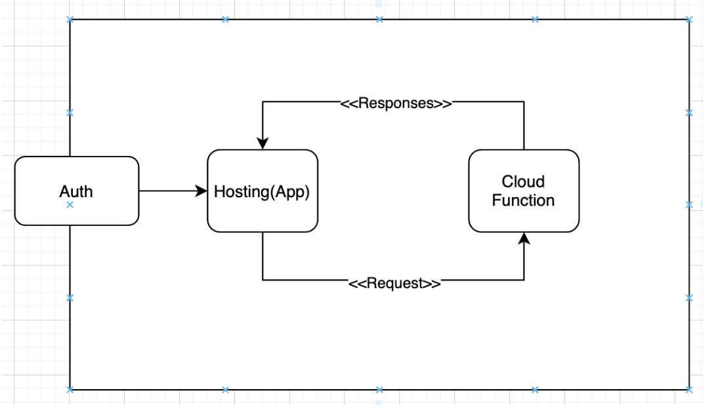

# Projeto GPASK


## Intro

Vamos nos imaginar numa turma, seja ela do trabalho ou universidade ou de um cursinho particular, nos deparamos com uma pergunta: como formamos grupos ? Quais as características que nos chamam atenção para nos sentirmos confortável para fazer um grupo de trabalho ou pesquisa ? chega a ser curioso quando pensamos a respeito, baseado nisso, propomos uma solução onde podemos formar grupo levando em conta as habilidades de hardskill de cada pessoa, levando em conta como trazer um equilíbrio para o grupo, com tantas pessoas com diferentes habilidades.

Para facilitar o processo de criação de grupos para trabalhos acadêmicos, será criado uma aplicação web que pudesse gerar uma turma com uma quantidade estipulada de alunos e que pudesse definir qual a quantidade de alunos por grupo, bem como quais hardskill cada aluno tem, como também o peso de cada hardskill.

Queremos levar como observação, a solução que propomos não leva em consideração diversos outros aspectos tais como: empatia, ambiente, experiência de vida e entre outros aspectos que fazem muita diferença quando conhecemos alguém presencialmente e que nesses casos fica difícil mensurar em números essas característica, baseado nisso, queremos reforçar que apresentaremos uma ideia em uma aplicação web de como formar grupo, na prática não poderemos garantir a qualidade de um grupo baseado na metodologia que será abordada.

## Desenvolvimento

Teremos como primeira etapa da aplicação web o usuário fazer um login, após isso ele poderá configurar sua turma e grupos; O usuário pode definir o número da turma, a quantidade máxima de alunos, a quantidade de pessoas que um grupo de ter, pode definir 3 hardskill bem como o peso de cada hardskill. Com o intuito de testar a metodologia, gerando um Mock da turma, incluindo os alunos e sua lista de valores aleatórios de skills.

Para começar o processo de aplicação da metodologia, o algoritmo fornecera o nível de hardskill para membro do corpo da turma. Seu nível será calculado através de uma média ponderada entre as notas e o peso de cada hardskill, o resultado será armazenado em um atributo chamado de “grau_hardskill”.
Em seguida os membros serão ordenados em um array de acordo com seus níveis, do menor para o maior. Para esta ordenação será utilizado o Sistema de Distribuição Normal, onde a curva Gaussiana será capaz de gerar um padrão regular de skills. Todos os recursos e ferramentas necessários para a montagem do Sistema de Distribuição Normal serão previstos e utilizados no algoritmo.

A partir de um array ordenado, os alunos serão agrupados, sempre pegando o aluno de menor grau com o aluno de maior grau, o segundo aluno de menor grau com o segundo aluno de maior grau, o terceiro aluno de menor grau com o terceiro aluno de maior grau e assim por diante, ou seja, pegando os alunos que estão nos extremos opostos do array. Fazemos esse processo até que chegue no limite que foi definido pelo professor.


## Dependencia

- node >= 14.x
- firebase >= 9.x

## Inicialização Local
No terminal, na raiz do projeto use: 
### Setup
- ```make setup```

### Run Firebase
- ```make run-firebase```

### Teste metodologia GPASK
 - ```make test-functions```

### Deploy hosting
```make deploy-firebase-hosting```


Ao usar os comandos para run local, você poderá ver a aplicação nos endpoints: 

- App(hosting): http://localhost:5000
- Cloud Functions: http://localhost:5001/projeto-gpask/us-central1/gpaskMethodology
- Firestore: http://localhost:8080


## Arquitetura
